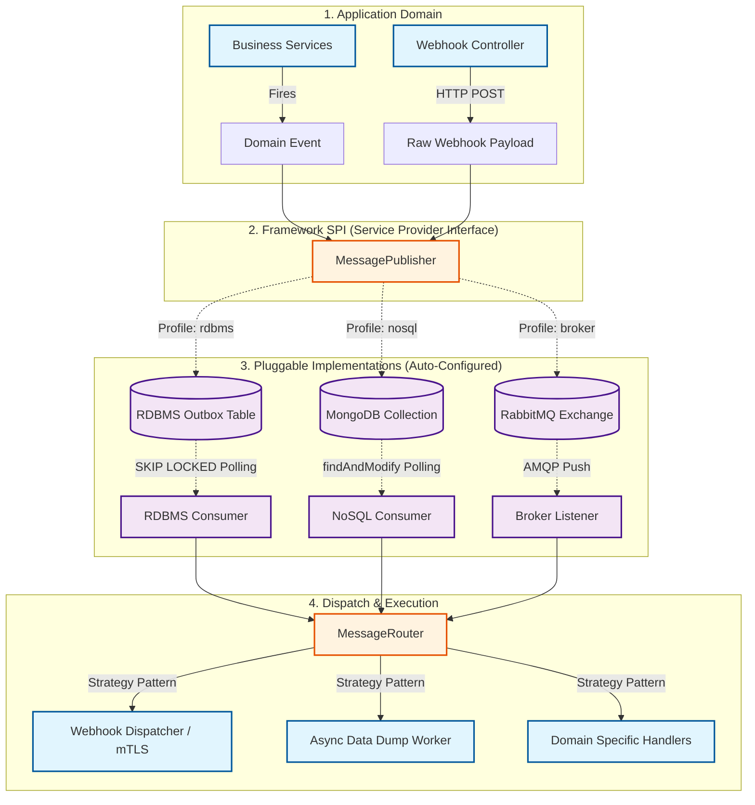

# Technical Specification: Pluggable Messaging & Data Delivery Framework

**Author:** System Architecture Team

**Target Environment:** Java 17+, Spring Boot 3.x, Pluggable Backends (Oracle DB, NoSQL, Message Brokers)

**Document Version:** 0.0.1

**Status:** Approved for Implementation

---

## 1. Executive Summary

This specification defines the design for a highly available, pluggable messaging and data delivery framework. While initially designed to operate under strict infrastructure constraints (brokerless, utilizing Oracle Database `SKIP LOCKED`), the framework is completely abstracted from its underlying storage and transport mechanisms.

It provides reliable, at-least-once message delivery, webhook processing, and asynchronous bulk data extraction across a clustered Spring Boot application environment. Through an interface-driven architecture, the framework supports seamless transitions between relational databases, NoSQL databases (e.g., MongoDB), and dedicated message brokers (e.g., RabbitMQ) via Spring Auto-Configuration and Profiles.

---

## 2. Architecture Overview

### 2.1 Interface-Driven Abstraction (Mermaid Flowchart)



---

## 3. Core Abstractions (The SPI Layer)

To ensure the framework is never bound to hardware or specific databases, the core logic relies on two primary interfaces.

### 3.1 MessagePublisher

Used by the application to dispatch a message. The implementation dictates if this writes to a database transaction or sends to a network broker.

```java
public interface MessagePublisher {
    void publish(String messageType, String payload, DeliveryMode mode);
}

```

### 3.2 MessageConsumer

Responsible for retrieving messages and passing them to the central `MessageRouter`.

```java
public interface MessageConsumer {
    void startConsuming(MessageRouter router);
    void acknowledge(String messageId);
    void markFailed(String messageId, Exception e);
}

```

---

## 4. Pluggable Implementations

The framework dynamically loads the correct implementation based on the active Spring Profile (e.g., `spring.profiles.active=messaging-oracle` or `messaging-rabbitmq`).

### 4.1 RDBMS Implementation (Oracle/PostgreSQL)

* **Publisher:** Hooks into Spring's `@TransactionalEventListener` to write a record to the `MESSAGE_OUTBOX` table in the same ACID transaction as the business logic.
* **Consumer:** A `@Scheduled` task that polls the database.
* **Concurrency Control:** Uses `FOR UPDATE SKIP LOCKED` (Oracle/Postgres) to ensure clustered Tomcat nodes do not process the same rows.
* **Schema Requirement:**
```sql
CREATE TABLE message_outbox (
    id VARCHAR2(36) PRIMARY KEY,
    message_type VARCHAR2(100) NOT NULL,
    payload CLOB NOT NULL,
    status VARCHAR2(20) DEFAULT 'PENDING'
    -- includes retry counts, timestamps, etc.
);
CREATE INDEX idx_outbox_polling ON message_outbox(status, next_retry_at);

```


### 4.2 NoSQL Implementation (MongoDB)

* **Publisher:** Writes a document to a MongoDB collection. If using MongoDB 4.0+, this can participate in multi-document transactions.
* **Consumer:** A `@Scheduled` task that polls the collection.
* **Concurrency Control:** Uses `findAndModify` (atomic update) to transition a document's status from `PENDING` to `PROCESSING`, ensuring thread safety across the cluster.

### 4.3 Message Broker Implementation (RabbitMQ / Kafka)

* **Publisher:** Uses Spring AMQP (`RabbitTemplate`) or Spring Kafka to publish the message directly to an Exchange/Topic.
* **Consumer:** Uses `@RabbitListener` or `@KafkaListener`.
* **Concurrency Control:** Delegated entirely to the broker (e.g., RabbitMQ consumer groups). No polling required; messages are pushed to the application.

---

## 5. Router & Handlers (Strategy Pattern)

Regardless of how the message arrives (Polled from DB, Polled from Mongo, or Pushed from RabbitMQ), it is handed to the `MessageRouter`.

### 5.1 EventHandler Interface

```java
public interface EventHandler {
    boolean supports(String messageType);
    void handle(MessageContext context) throws Exception;
}

```

### 5.2 MessageRouter

Autowires a `List<EventHandler>`. When the consumer delivers a message, the router finds the matching handler and executes it.

---

## 6. Security & Integrations

### 6.1 Webhook Dispatcher (mTLS)

When the framework needs to send data out via webhooks, it routes to the `ExternalWebhookDispatcher` handler.

* Constructs a reactive `WebClient` dynamically.
* Injects an `SslContext` loaded with client keystores (`.jks` / `.p12`) to fulfill Mutual TLS (mTLS) requirements.
* Implements an internal circuit breaker and timeout (default 5s) to prevent thread exhaustion if the target webhook is slow.

### 6.2 Async Data Dump (Cursor Streaming)

Heavy extraction tasks route to the `DataDumpWorker` handler.

* To remain agnostic, the worker requires the persistence layer to provide a `Stream<T>` interface.
* In the RDBMS implementation, this utilizes `@QueryHints(HINT_FETCH_SIZE)` to stream database cursors.
* In the MongoDB implementation, this utilizes `MongoCursor` batching.
* Writes output directly to temporary files or cloud storage without loading full datasets into heap memory.

---

## 7. Maven Multi-Module Structure

```text
brokerless-workspace/
├── pom.xml                                  (Parent POM)
├── framework-core/                          (SPI Interfaces, Router, Handlers)
├── framework-impl-rdbms/                    (Oracle SKIP LOCKED implementation)
├── framework-impl-nosql/                    (MongoDB findAndModify implementation)
├── framework-impl-amqp/                     (RabbitMQ implementation)
├── sample-app-main/                         (Test App using the framework)
└── sample-mtls-receiver/                    (Mock mTLS Server for webhook tests)

```

---

## 8. Delivery Guarantees & Fault Tolerance

| Scenario | RDBMS / NoSQL Behavior | RabbitMQ / Kafka Behavior |
| --- | --- | --- |
| **Node Crash During Processing** | Heartbeat monitor resets `PROCESSING` records back to `PENDING` after timeout. | Unacknowledged messages are automatically requeued by the broker. |
| **External Webhook Down** | Retry loop uses exponential backoff updating `next_retry_at` in the database. | Messages sent to a Dead Letter Exchange (DLX) with delayed requeuing. |
| **Concurrent Reads** | Prevented by DB native row-level locking. | Prevented by Broker consumer group mechanics. |
