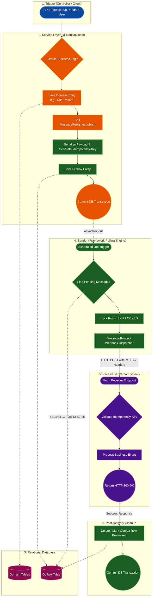

# Framework RDBMS Module

Implements outbox persistence using relational databases with JDBC event listeners and cluster-safe scheduled pollers.

## 1. Outbox Mechanisms
- **Mapped Entity**: The base outbox configuration uses `@MappedSuperclass` `AbstractOutboxEntity` which maps outbox database mappings to concrete entities.
- **SKIP LOCKED Polling**: Employs database concurrency features to safely partition and query rows without locking threads across multiple clusters.
- **Exponential Backoff**: Failed outbound webhook attempts are rescheduled using an exponential backoff algorithm (`2^retryCount` seconds delay).

## 2. Auto-Configuration Properties

Configure these properties in your application context (`application.yml` or `application.properties`):

| Property | Default | Description |
| :--- | :--- | :--- |
| `brokerless.messaging.enabled` | `true` | Toggles the outbox poller engine bean setup. |
| `brokerless.messaging.poll-interval-ms` | `2000` | Scheduled frequency (milliseconds) for querying the outbox database table. |
| `framework.messaging.webhook.mtls.keystore-path` | - | Location (classpath: or file path) for the outbound client keystore. |
| `framework.messaging.webhook.mtls.keystore-password` | - | Password for unlocking client keystore. |
| `framework.messaging.webhook.mtls.truststore-path` | - | Location for verifying external servers. |
| `framework.messaging.webhook.mtls.truststore-password` | - | Password for unlocking truststore. |

## 3. Logical Flow

